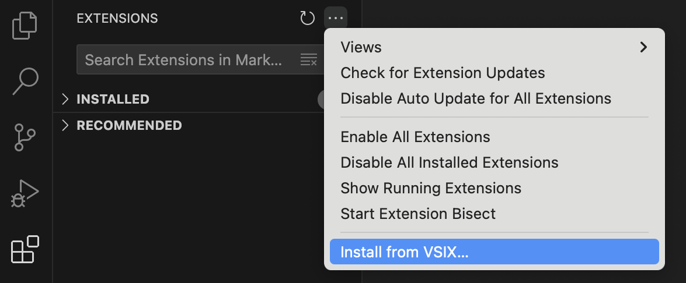
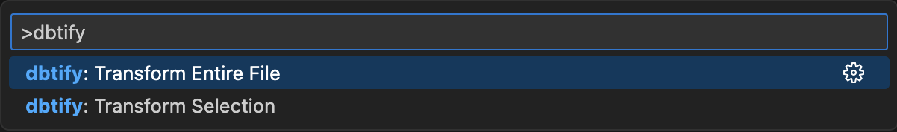

# dbtify

VSCode extension to replace SQL table references with dbt model refs

## Installation

- [Download the .vsix file](https://raw.githubusercontent.com/sahilng/dbtify/main/dbtify-1.0.0.vsix)
- Install

## Usage
Command Palette
