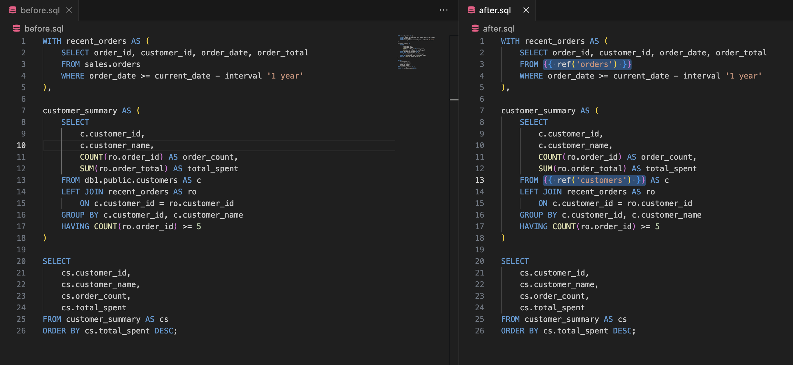

#  dbtify

VSCode extension to replace SQL table references with dbt model refs

## Installation

### [VSCode Extension Marketplace](https://marketplace.visualstudio.com/items?itemName=sahilng.dbtify)

### Or manually:

- [Download the .vsix file](https://raw.githubusercontent.com/sahilng/dbtify/main/dbtify.vsix)
- Install

## Usage
Command Palette

## Example

